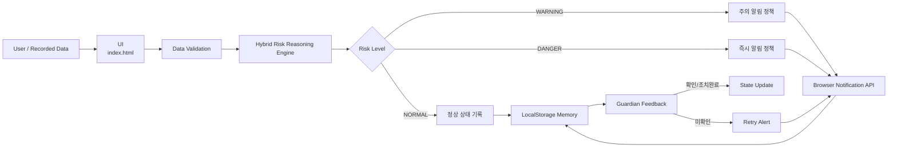

# SilverGuard Architecture

**독거노인 실시간 위기알림 AI Agent · GitHub v1.0**

> 이 문서는 심사위원이 SilverGuard의 **Goal → Data → Reasoning → Tool → Memory → Feedback** 구조와 실제 소스 위치를 빠르게 검증할 수 있도록 정리한 기술 아키텍처 문서입니다.

---

## 1. 목적과 범위

SilverGuard는 독거노인의 상태 데이터를 입력받아 유효성을 확인하고, 통계적 이상징후와 복합 위험규칙을 이용해 위험도를 판단한 뒤 필요한 행동을 선택하는 경진대회용 AI Agent MVP입니다.

위험상황에서는 **로컬 Browser Notification API를 Tool로 호출**하고, 사건과 판정 결과를 **LocalStorage에 Memory/State로 저장**합니다. 이후 보호자의 확인 또는 미확인 재알림을 Feedback으로 받아 사건 상태를 갱신합니다.

> 현재 버전은 의료진단 시스템이 아니며, 원격 SMS·FCM·119 자동전송을 구현한 시스템도 아닙니다.

---

## 2. 전체 아키텍처



동일 구조를 텍스트로 표현하면 다음과 같습니다.

```text
상태 데이터 입력
  ↓
데이터 유효성 검사
  ↓
통계적 기준선 편차 + 복합 위험규칙
  ↓
위험점수 산정
  ↓
NORMAL / WARNING / DANGER
  ↓
Action Policy 선택
  ├─ NORMAL  → 정상 상태 기록
  ├─ WARNING → 주의 알림 + 재확인
  └─ DANGER  → 즉시 알림 + 재알림 정책
  ↓
Browser Notification Tool
  ↓
LocalStorage 사건 Memory 저장
  ↓
보호자 확인 / 미확인
  ↓
상태 갱신 / 재알림 Feedback
```

---

## 3. AI Agent 6요소 대응

| 요소 | SilverGuard 구현 | 검증 위치 |
|---|---|---|
| Goal | 독거노인 위험상황 조기 감지 및 대응 연결 | `index.html`, `src/js/app.js` |
| Planning / Action Policy | 위험등급에 따라 정상기록, 주의알림, 즉시알림, 재확인 행동 선택 | `src/js/risk-engine.js` |
| Reasoning | 기준선 편차 + 복합 위험규칙 + 위험점수 | `src/js/risk-engine.js` |
| Tool Use | Browser Notification API 호출 | `src/js/notification.js` |
| Memory / State | 사건·판정·알림·확인 상태를 LocalStorage에 저장 | `src/js/storage.js` |
| Feedback | 보호자 확인/조치완료 또는 미확인 재알림 | `src/js/app.js` |

SilverGuard의 Agent성은 특정 LLM 호출이 아니라, **입력 데이터를 바탕으로 상태를 판단하고 다음 행동을 선택한 뒤 Tool과 Memory를 사용하고 Feedback을 반영하는 End-to-End Workflow**에 있습니다.

---

## 4. Reasoning Engine

핵심 판단 모듈은 `src/js/risk-engine.js`입니다.

### 4.1 입력 데이터

- 미활동 시간(분)
- 심박수(bpm)
- 주간 / 야간
- 현관문 이벤트
- 집 밖 위치 감지
- 사용자 응답 여부
- 상황 메모

### 4.2 데이터 유효성 검사

비정상 또는 누락 데이터가 들어오면 그대로 위험판정을 진행하지 않고 데이터 품질 문제로 처리합니다. 예를 들어 심박수 0과 같은 값은 재확인이 필요한 입력으로 분류합니다.

### 4.3 통계적 이상징후

현재 MVP에서는 설명 가능한 단순 기준선을 사용합니다.

- 미활동 기준선: 약 35분
- 미활동 scale: 45분
- 심박 기준선: 약 75 bpm
- 심박 scale: 18 bpm
- 기준선 편차를 조합한 anomaly score는 최대 25점으로 제한

이는 학습된 의료모델의 예측값이 아니라 **MVP용 통계적 이상징후 점수**입니다.

### 4.4 복합 위험규칙

주요 위험요소를 가중 합산합니다.

| 위험요소 | MVP 점수 규칙 |
|---|---:|
| 미활동 60분 이상 | +8 |
| 미활동 120분 이상 | +18 |
| 미활동 180분 이상 | +28 |
| 심박 105 이상 또는 55 이하 | +16 |
| 심박 120 이상 또는 45 이하 | +30 |
| 야간 + 현관문 이벤트 | +12 |
| 야간 + 외부 위치 감지 | +18 |
| 사용자 무응답 | +20 |
| 180분 이상 미활동 + 무응답 | +8 추가 |
| 고위험 심박 + 무응답 | +8 추가 |

최종 점수는 100점을 상한으로 합니다.

### 4.5 위험등급

| 점수 | 결과 |
|---:|---|
| 0 ~ 29.9 | NORMAL |
| 30 ~ 59.9 | WARNING |
| 60 ~ 100 | DANGER |

이 임계값은 임상적으로 검증된 의료 기준이 아니라 **경진대회 MVP에서 Agent의 판단·행동 흐름을 검증하기 위한 휴리스틱**입니다.

---

## 5. Action Policy

Reasoning 결과에 따라 Agent가 다음 행동을 선택합니다.

### NORMAL
- 정상 상태 기록
- 지속 모니터링

### WARNING
- 보호자에게 주의 알림을 가정한 로컬 브라우저 알림 실행
- 일정 시간 내 상태 재확인 권고

### DANGER
- 즉시 보호자 알림을 가정한 로컬 브라우저 알림 실행
- 복지기관/담당자 확인 권고
- 미확인 시 재알림 수행 가능

즉, SilverGuard의 Planning은 복잡한 범용 Planner가 아니라 **위험등급에 따라 다음 행동을 선택하는 명시적 Action Policy**입니다.

---

## 6. Tool Layer

`src/js/notification.js`가 Tool 계층을 담당합니다.

- Browser Notification API 사용
- 사용자가 알림 권한을 허용한 경우 로컬 브라우저/OS 알림 생성
- 권한 제한 시에도 Agent의 판단 및 사건기록은 계속 동작

> 현재 Tool은 실제 원격 보호자 SMS/FCM 전송이 아니라 **보호자 알림을 가정한 로컬 MVP Tool**입니다.

---

## 7. Memory / State

`src/js/storage.js`가 Memory/State 계층을 담당합니다.

사건별로 다음 상태를 브라우저 LocalStorage에 저장합니다.

- 사건 ID
- 발생 시간
- 입력 데이터
- 위험등급
- 위험점수
- 판단근거
- Tool 실행 상태
- 보호자 확인 상태

이를 통해 단순 일회성 판단이 아니라 **사건 발생 → 저장 → 확인 → 상태변경**의 흐름을 추적할 수 있습니다.

---

## 8. Feedback Loop

보호자 또는 담당자의 확인 결과는 Agent 상태에 다시 반영됩니다.

```text
위험 사건 발생
→ 알림 Tool
→ 사건 Memory 저장
→ 보호자 확인?
   ├─ YES → 조치완료 상태로 갱신
   └─ NO  → 재알림 가능
```

이 구조가 SilverGuard의 Human-in-the-Loop Feedback입니다.

---

## 9. Module Responsibilities

| 파일 | 역할 |
|---|---|
| `index.html` | 사용자 입력·결과·Workflow·사건이력 UI |
| `assets/css/style.css` | 화면 레이아웃 및 상태 시각화 |
| `src/js/risk-engine.js` | 데이터검증, 이상징후, 위험점수, 등급, Action Policy |
| `src/js/notification.js` | Browser Notification Tool |
| `src/js/storage.js` | LocalStorage 기반 Memory / State |
| `src/js/test-cases.js` | 대표 Test Case 6건 정의 |
| `src/js/app.js` | UI와 Reasoning/Tool/Memory/Feedback 모듈 연결 |
| `tests/risk-engine.test.js` | Risk Engine 자동 검증 |
| `.github/workflows/test.yml` | GitHub Actions 자동 테스트 |

---

## 10. Test Architecture

대표 Test Case는 정상부터 복합 고위험, 데이터 오류까지 6개입니다.

| TC | 시나리오 | 기대 결과 |
|---|---|---|
| TC1 | 정상 | NORMAL |
| TC2 | 장시간 미활동 | WARNING |
| TC3 | 심박 이상 + 무응답 | DANGER |
| TC4 | 야간 외출 | WARNING |
| TC5 | 복합 고위험 | DANGER |
| TC6 | 데이터 오류 | WARNING / 데이터 재확인 |

핵심 Risk Engine은 Node.js에서 독립 검증할 수 있으며 GitHub Actions에서도 자동 실행됩니다.

```bash
node tests/risk-engine.test.js
```

---

## 11. Trust Boundary / 보안 범위

현재 v1.0은 브라우저 단일 사용자 MVP입니다.

구현하지 않은 범위:

- 서버 인증/인가
- 다중 사용자 계정
- DB 서버
- 개인정보 암호화 저장
- 실센서/웨어러블 연동
- 실제 SMS/FCM/119 자동전송
- 고가용성/장애복구
- 의료적 임상검증

실서비스에서는 위 항목을 별도 Backend / Security / Device Integration 계층으로 추가해야 합니다.

---

## 12. 심사위원 검증 포인트

1. `index.html`을 실행합니다.
2. TC5 복합 고위험 시나리오를 선택합니다.
3. DANGER 등급과 위험점수, 판단근거를 확인합니다.
4. Browser Notification Tool 또는 Tool 실행 상태를 확인합니다.
5. 사건이 Memory에 저장되는지 확인합니다.
6. 보호자 확인/조치완료 후 상태변경을 확인합니다.
7. 전체 Test Case 6건을 실행합니다.
8. `src/js/risk-engine.js`와 `tests/risk-engine.test.js`를 비교해 구현과 테스트를 확인합니다.

---

## 13. 핵심 한계

SilverGuard v1.0은 **실제 의료 서비스가 아니라 AI Agent 구조를 검증하는 경진대회용 MVP**입니다.

실제 현장 적용 전에는 실센서 연동, 사용자 인증, 개인정보 보호, 복지기관 시스템 연계, 반복 실증, 의료·응급대응 절차 검토가 필요합니다.

자세한 내용은 [`SAFETY_LIMITATIONS.md`](SAFETY_LIMITATIONS.md)를 참고하세요.